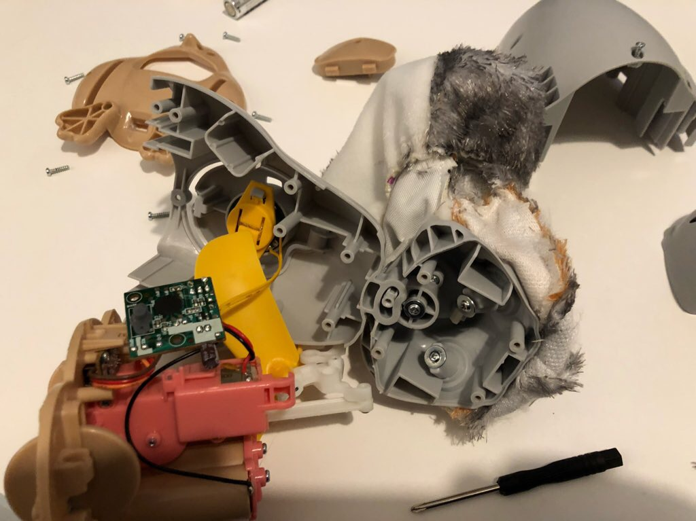
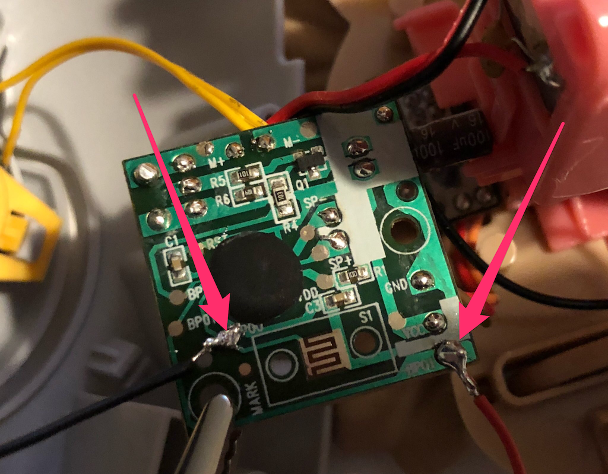
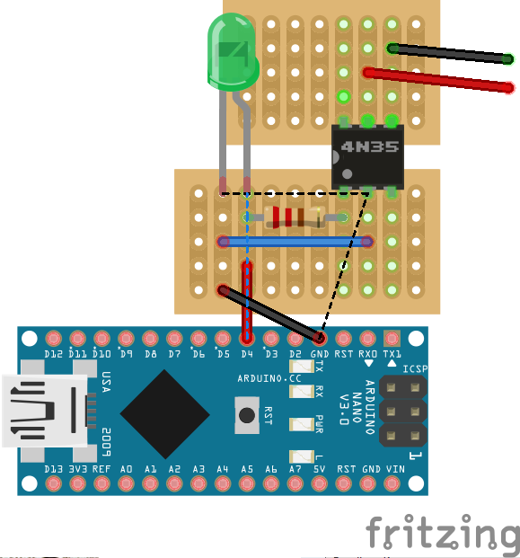

[](https://github.com/prettier/prettier)
[](#contributors)
[](code-of-conduct.md)

# Porg

🐧 Controlling a plush Porg via Node.js

## Usage

Make sure your hacked Porg is connected. See below for the Porg setup.

```bash
# Install globally

npm install -g porg
porg -e 'node myScript.js'

# Use npx
npx porg -e 'node myScript.js'
```

## Porg Requirements

* [Electronic Disney Plush Porg](https://www.amazon.com/Chatter-Animated-Electronic-Plush-Friday/dp/B077717W6K/ref=sr_1_4?ie=UTF8&qid=1520953495&sr=8-4&keywords=disney+porg)
* Arduino with Firmata firmware as described on johnny-five.io
* A breadboard
* Wires
* 220Ω resistor
* Optocoupler (4N35)

## Porg Setup

1.  Remove all the screws and fur until you get to the inside control plate
    
2.  Solder to long wires on the control plate as shown on this picture
    
3.  Create a circuit as shown on the picture below:
    
4.  Connect Arduino to your computer

## Contributing

Please note that this project is released with a [Contributor Code of Conduct](code-of-conduct.md). By participating in this project you agree to abide by its terms.

## Contributors

Thanks goes to these wonderful people ([emoji key](https://github.com/kentcdodds/all-contributors#emoji-key)):

<!-- ALL-CONTRIBUTORS-LIST:START - Do not remove or modify this section -->

<!-- prettier-ignore -->
| [<br /><sub><b>Dominik Kundel</b></sub>](https://moin.world)<br />[💻](https://github.com/dkundel/about-json/commits?author=dkundel "Code") |
| :---: |

<!-- ALL-CONTRIBUTORS-LIST:END -->

This project follows the [all-contributors](https://github.com/kentcdodds/all-contributors) specification. Contributions of any kind welcome!

## License

MIT
